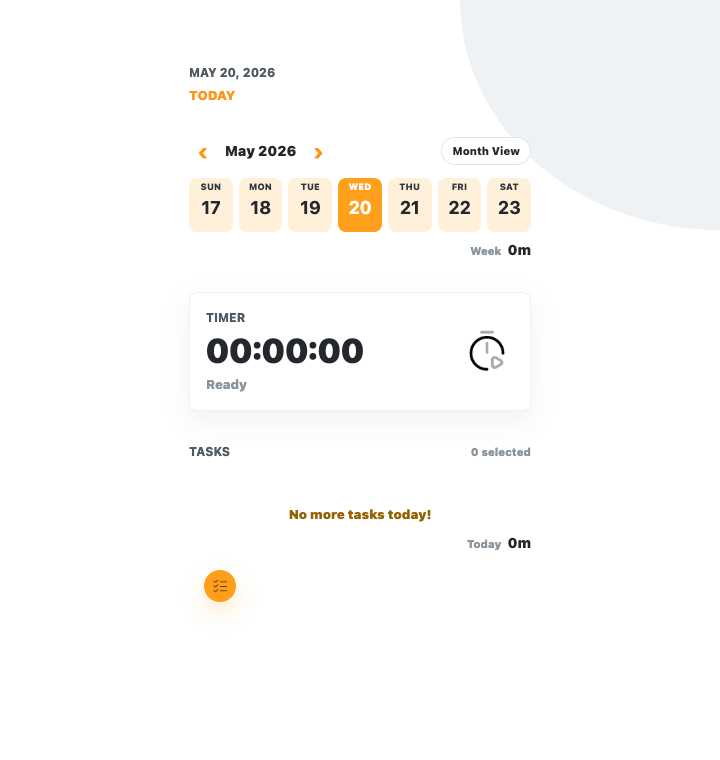

# TodidLog

Timer-based work log PWA.



## Features

- Track focused work with a start/stop timer.
- Add, edit, delete, tag, and merge task records.
- Switch between weekly and monthly calendar views with animated transitions.
- Copy a monthly report to the clipboard.
- Store records on the local Node server with an IndexedDB browser cache.

## Run

```bash
npm run dev
```

Then open:

```text
http://localhost:5151
```

Devices on the same local network can open the LAN URL printed by the server, for example:

```text
http://192.168.0.6:5151
```

## Configuration

TodidLog stores app state in SQLite through the local Node server. By default, the database is written to:

```text
data/todidlog.sqlite
```

Use a Node.js version that supports the built-in `node:sqlite` module.

Set `TODIDLOG_SQLITE_PATH` to use another database path. TodidLog uses username/password authentication with `HttpOnly` session cookies. The first user can register without a token. After at least one user exists, new account creation requires `TODIDLOG_REGISTRATION_TOKEN`; if the token is not configured, registration is closed.

TodidLog can optionally rewrite daily fortune copy with Gemini through the local backend proxy. The browser never receives the API key.

For local development, copy `.env.example` to `.env.local` and set:

```text
TODIDLOG_REGISTRATION_TOKEN=your-registration-token
TODIDLOG_GEMINI_API_KEY=your-api-key
```

Then run:

```bash
npm run dev
```

`GEMINI_API_KEY` is also accepted as a fallback. `PORT`, `HOST`, `TODIDLOG_SESSION_DAYS`, `TODIDLOG_COOKIE_SECURE`, `GEMINI_TIMEOUT_MS`, `GEMINI_MAX_OUTPUT_TOKENS`, and `GEMINI_THINKING_BUDGET` can be set when the default local server settings need to change. `HOST` defaults to `0.0.0.0` so devices on the same trusted local network can reach the app.

## Structure

- `index.html`: App shell and modals
- `src/styles.css`: Tailwind CSS source and custom UI styling
- `src/fortune-engine.js`: Daily fortune calculation logic
- `styles.css`: Generated stylesheet
- `app.js`: Timer, records, grouping, calendar, and server sync cache logic
- `scripts/server.mjs`: Static file server and Gemini backend proxy
- `scripts/env.mjs`: Local environment file parser for server-side configuration
- `manifest.webmanifest`: PWA metadata
- `service-worker.js`: Offline cache with network-first updates

## Data

Records are stored per user in server-side SQLite and cached in browser IndexedDB for the signed-in user. On startup, the app loads server state first. If a signed-in user has no server state yet, matching local IndexedDB data is uploaded to that user's account. If the server is unavailable during saves, the app keeps the latest local cache and logs the sync failure in the browser console.
